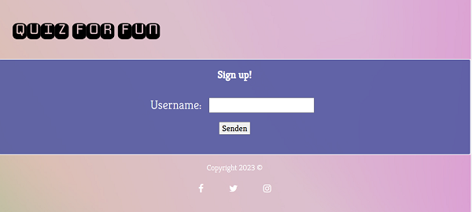
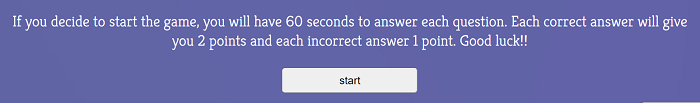
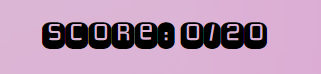
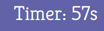
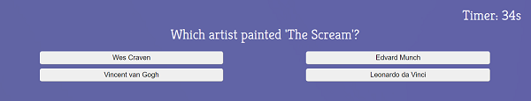
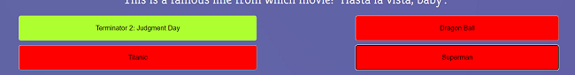
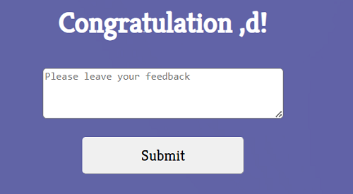
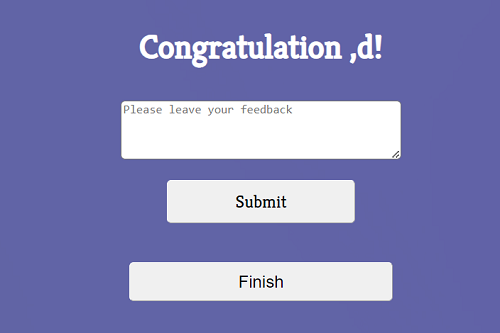

# Quiz For Fun.

## Introduction.

- This site targets users who love and enjoy questions of general knowledge and further challenges. Quiz For Fun is a site with potential for growth to use more advanced JavaScrip code and to expand the possibilities of what can be achieved on my website. The web page uses HTML, CSS, and JavaScript to interact with the users; by counting the score and time-targeted questions.
- The primary purpose of the game is not to determine who the winner, is to share a small amount of cultural information in a fun and competitive way.

## Features.

## 1. Existing features:

- ### The logo:

  - The retro logo and vintage colors bring the nostalgic feeling back to life.
  - The logo in the left top corner to not distract the eyesight while the questions are being answered.

    

- ### The landing page:

    *  The main page lands immediately with a gathering of username information with a validation feature. This means the name will not be stored if another user uses the username.
    * Quiz for fun needs to be given the username to enter the game because it will use the username at the end of the game to recognize the player's efforts.

   

- ### The instructions section:

  - A small instruction section to give knowledge to the player about the score sum and timer.
  - The score uses JS to count every time the user clicks a choice.
  - The countdown timer uses JS. When the time is finished, the next button appears to continue with the quiz.

    

- #### The questions and answers section:

  - Using JS technology, the question and answers will appear together with the score and the timer after the form and instructions.
  - For each correct answer, the player will receive 2 points and 1 point if the answer is wrong.

    -  

  - When the correct answer is chosen, the icon will light green. On the other hand, when the player chooses the wrong answer, all the icons will be shown red except the correct answer.
  - As already mentioned, when the time reaches zero, the next button will appear without revealing the answers, and no way to go back to keep fair the score earned.

     -  

     
    
     

- ### The feedback section:

  - To keep up with our primary objective, after all the questions are answered, the username given before will be used to receive a "congratulation."
  - Afterwards, there are two options: finish the game by submitting the feedback or restart the game and play again to earn a higher score.

    

- #### The footer section:

  - It has our social media links, which open in a different tab, to help the user not to lose our site but also to stay connected with us and informed.

    

### 2. Features excluded.

- #### A table score:

  - Gathering all the usernames and creating a ranking score table will be possible to determine which player scored the most points.

- #### The difficulty section:

  - It will be fun to add, in the future, the difficulty section and filter the questions by subject.

## Testing.

- Using the links provided by Code institute, my code was tested rigorously throughout creating a webpage using HTML5, CSS, and JavaScript language.
- The author used Mozilla, Chrome, and Safari to test the website. 
- The score uses JS hear events. The score is based on the clicks. The player will earn two points for every correct answer, as mentioned above. Nevertheless, the player can click at any time, accumulating more points. However, the game's intention is not to determine the winner but rather to acquire knowledge in a fun way. If a table score should in the future be implemented, this will be necessary to fix.
- The most significant task in testing was to manage to connect the dots on JavaScript and the workflow. Definitely, the lack of experience played a role, but no excuse not to look for further information. That is why I followed the workflow of other web developers to learn the best way to achieve the best results.
- Further in the ReadMe, the reader will see about the unfixed bugs, but as an introduction, it will be mentioned that exhaustive testing and changing the code was done many times, with no success. The most probable reason is that the quiz game is based on the event listener "clicks." For further projects, this is a great argument to take into consideration.

### Validator testing.

- #### HTML:
  - No errors were returned when passing through the official [W3C validator.](https://validator.w3.org/nu/#textarea)

- #### CSS:
  - No errors were returned when passing through the official [W3C CSS validator.](https://jigsaw.w3.org/css-validator/validator?uri=https%3A%2F%2Fbrianrosenkranz.github.io%2FQuiz-for-fun%2F&profile=css3svg&usermedium=all&warning=1&vextwarning=&lang=en)

- #### JavaScript: 
    - No errors were found when passing through the official Jshint validator. However 37 warnings because of the use of <code>let/const</code> and web incompatibility.
    - The following metrics were returned:
        - There are 17 functions in this file.
        - Function with the largest signature takes two arguments, while the median is 0.
        - Largest function has 15 statements, while the median is 3.
        - The most complex function has a cyclomatic complexity value of 3 while the median is 1.

### Unfixed bugs.

- These three bugs are discovered:
    1. The form uses the validation function not to let the player fill in the space with a space keypad. It will throw an alert but still allow the player to play. The reason for this is that the form does not have <code>action="" nor method=""</code> on the HTML tab, and on the JS tab, the <code> variable.submit()</code> is left as a comment, due to the same reason. It will open another page in the parent page and not allow the player to play.
    2. The timer will reset with each question being answered. The first problem was that when the timer reached 0, it would go to negative numbers. To fix this, I used the <code>clearInterval()</code>, which landed with the second problem. When the timer reaches 0, it will not start up again. So with a for loop, reset it every time the player presses the next button. The problem was that the timer would speed faster with every reset. To partially fix the problem, I used an <code> if statement</code>; every time the timer reaches 0, it will start up again in an infinite loop until the player press next.
    3. At the end of the game, the player can submit his optional feedback or finish the game. Line 119 in the JS tab, <code> nextButtons.classList.add("hide")</code>. The reason to hide the button is that there is no further question; it will come back with an error in the console on line 83 of the JS tab because there are no further questions. Nevertheless, it would not add the class selector. The bug is to be resolved. The game is still functional, and pressing the submit button will restart it as planned. There is a comma before the username to be found. It is not in the HTML in the <code> <h3></h3></code> nor in the Javascript file.

  

## Deployment.

- After committing and pushing from Gitpod, the website was deployed using Github.
- Steps:
  - First, navigate to the settings tab in the quiz-for-fun repository.
  - Afterward, click on the Page tab on the left side of the site.
  - Open a new section, "Build and deploy," choose the source, deploy from the branch, and then choose the main branch.
  - After that, the site was refreshed, and the link to visit the quiz-for-fun website appeared.
  - After a few minutes, the author received an email from GitHub that the deployment of the webpage was successful.
- The link to the website is https://brianrosenkranz.github.io/Quiz-for-fun/.

## Credit.

### Media:

- The background image is taken from [pexels](https://www.pexels.com/photo/colorful-abstract-background-with-lines-and-lights-6985045/)
- The use of Pinterest was necessary for obtaining ideas for web design.
- The icons came from [Fontawesome](https://fontawesome.com/).
- The font family is imported from Google Fonts.

### Content

- All the HTML content and questions were personally created.
- The following internet pages obtained the flex element for CSS and the grid. (https://css-tricks.com/snippets/css/a-guide-to-flexbox/ and https://www.w3schools.com/.
 - Media query was taken from Code institute and a [GitHub blog](https://gist.github.com/mavieth/e0c8fdcb72a30d85f57a).
- The psychology of color is acquired on the following website. https://hs-marketing-contentful.imgix.net/https%3A%2F%2Fimages.ctfassets.net%2Fp15sglj92v6o%2F3zeRC0ATjrNo7vCfFoXs6%2F47858c9fee60a7a3a89722355e1ccdd7%2F5-17-emotion.png?ixlib=gatsbySourceUrl-2.0.2&auto=format%2Ccompress&w=690&h=605&s=9ee2ab0bfe321259db8388343dc68495
- I use the ReadMe template from [Coding Institute](https://github.com/Code-Institute-Solutions/readme-love-maths/blob/master/README.md).
- I based and credited my Javascript workflow with two YouTube tutorials [video #1](https://www.youtube.com/watch?v=riDzcEQbX6k&t=47s) and [video #2](https://www.youtube.com/watch?v=f4fB9Xg2JEY).
- The timer and form validation was fetched from Code Institue modules and [w3schools](https://www.w3schools.com/js/js_validation.asp).
- The random questions argument was supplied by [stackoverflow](https://stackoverflow.com/questions/43847375/creating-random-questions-and-answers-javascript).
